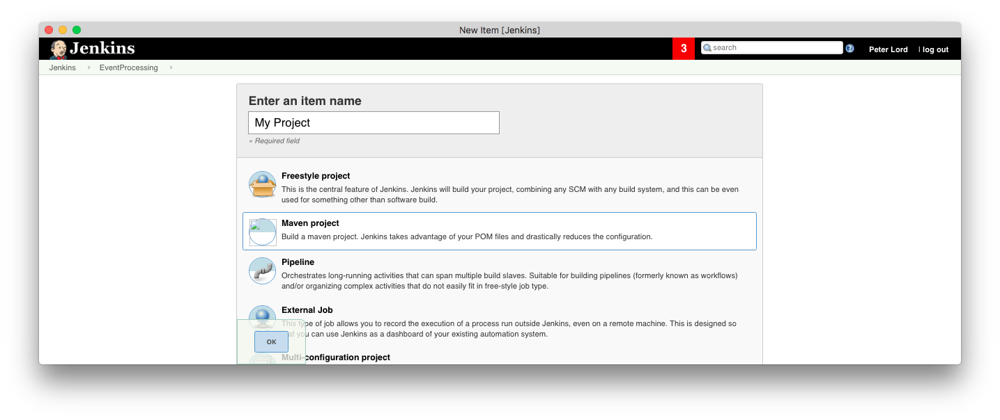
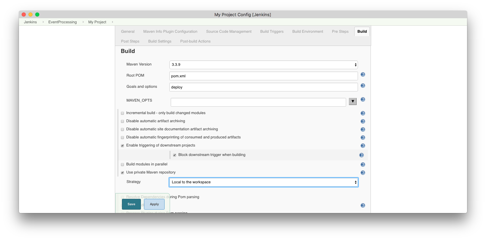

# Continuous integration examples

<!-- MACRO{toc|fromDepth=2} -->


## Jenkins

The [Jenkins continuous integration server](https://jenkins-ci.org/) contains
a [maven project plugin](https://wiki.jenkins-ci.org/display/JENKINS/Maven+Project+Plugin)
that can easily be configured to build, test and deploy
projects with the event processing maven plugin.


### Project type

  When creating a job, use the **Maven project** type :




### Set environment

The environment variable **TIBCO_EP_HOME** must be defined - setting it to the 
jenkins workspace is recommended :


### Build step

The maven goal has to be defined - typically this will be **deploy** so that
the full default lifecycle is executed.  Its also recommended to use a 
maven repository private to the workspace :



It is recommended to pass the environment variable BUILD_ID to created processes
so that jenkins can find and kill any left over processes :

``` shell
$ mvn -DenvironmentVariables=BUILD_ID=${BUILD_ID} ...
```


### Other configurations

1. The source code management has to be defined so that Jenkins
can find the source.

2. Suitable build nodes have to be defined

3. Additional Maven goals such as `site` and `sonar` can be defined.

4. [Email notifications](https://wiki.jenkins-ci.org/display/JENKINS/Email-ext+plugin) 
to the development team

5. Centralized [Maven settings](https://wiki.jenkins-ci.org/display/JENKINS/Config+File+Provider+Plugin)
